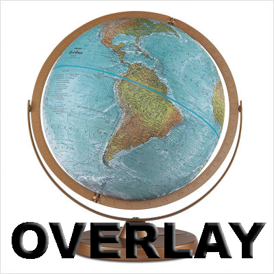
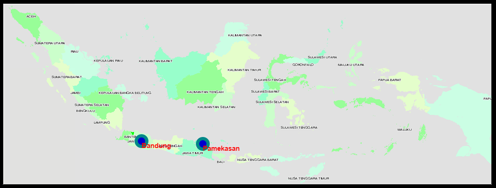

**Rangkuman Pertemuan 10 Sistem Informasi Geografis**

  

Resume Pertemuan 10 Sistem Informasi Geografis

Latar belakang

1. Apa itu Open Layer?
2. Apa yang dimaksud Marker?
3. Bagaimana cara menampilkan marker menggunakan Open Layer?

Open Layer adalah library javascript murni untuk menampilkan data peta di berbagai browser, tanpa server side dependencies. Open Layer mengimplementasikan javascript API untuk membangun rich web-based geographic application yang mirip dengan Google Maps dan MSN Virtual Earth APIS

Marker atau penanda genetic merupakan penciri individu yang dilihat oleh mata atau terdeteksi dengan alat tertentu yang menunjukkan genotype suatu individu. Di dalam sebuah peta atau maps, marker adalah suatu tanda yang menjelaskan atau memberitahukan suatu tempat atau wilayah agar user mengetahui lokasi yang dimaksud

Cara membuat marker dengan open layer terdiri dari:

- --Buka web [http://openlayers.org/en/latest/examples/overlay.html?q=overlay](http://openlayers.org/en/latest/examples/overlay.html?q=overlay)
- --Copy codenya dan edit seperti dibawah ini:

~~~
<!DOCTYPE html>
<html>
  <head>
    <title>Overlay</title>
    <link rel="stylesheet" href="https://openlayers.org/en/v3.20.1/css/ol.css" type="text/css">
    <!-- The line below is only needed for old environments like Internet Explorer and Android 4.x -->
    
    
    
    <link rel="stylesheet" href="https://maxcdn.bootstrapcdn.com/bootstrap/3.3.6/css/bootstrap.min.css">
    
    
  </head>
  <body>
    

    

      <!-- Clickable label for Vienna -->
      <a class="overlay" id="bandung" target="_blank" href="https://id.wikipedia.org/wiki/Kota_Bandung">Bandung</a>
      

      <!-- Clickable label for Vienna -->
      <a class="overlay" id="pamekasan" target="_blank" href="https://id.wikipedia.org/wiki/Kabupaten_Pamekasan">Pamekasan</a>
      

      <!-- Popup -->
      

    

    
  </body>
</html>
~~~

- --Kemudian simpan sebagai file .html
- --Setelah itu buka file .html tersebut, maka hasilnya akan seperti dibawah ini:

  

Penutup
Kesimpulan
Dari praktikum diatas dapat disimpulkan bahwa pembuatan marker dengan open layer beda tipis dengan membuat marker di google maps, hanya berbeda beberapa code saja dan cara pemanggilan mapsnya

Saran
Saran saya sebaiknya pembelajaran tentang open layer dapat diperjelas lagi agar mengetahui perbedaan yang signifikan antara google maps dan open layer

* Nama : Gilang Romadhanu Tartila
* NPM : 1144033
* Kelas : 3C
* Prodi : D4 Teknik Informatika
* Mata Kuliah : Sistem Informasi Geografis

Link Github : https://github.com/gilangtartila99/SistemInformasiGeografis2016

Referensi : 
1. https://gedearta83.wordpress.com/2012/11/03/dokumentasi-openlayers/
2. https://id.wikipedia.org/wiki/Penanda_genetik
3. http://openlayers.org/en/latest/examples/overlay.html?q=overlay

Scan Plagiarisme
1. smallseotools - Link https://drive.google.com/open?id=0B5gySyqZ4GGoYVpFVC0tRnl4cEk
2. searchenginereport - Link https://drive.google.com/open?id=0B5gySyqZ4GGoNjRscGwzbkU4YmM