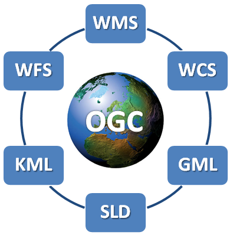

**Rangkuman Pertemuan 9 Sistem Informasi Geografis**

  

Latar Belakang Masalah

1. Open Geospatial Consortium (OGC)
2. Arsitektur Open Geospatial Consortium (OGC)
3. Geospatial Web Services (GWS)
4. Tipe Geospatial Web Services (GWS)
5. Penggunaan Open Layer Dengan MapProxy

Open Geospatial Consortium (OGC)

Open Geospatial Consortium (OGC) adalah sebuah konsorsium industri internasional yang didirikan pada tahun 1994 yang terdiri dari hampir 500 perusahaan, instansi pemerintahan, organisasi penelitian, LSM, dan universitas diseluruh dunia yang berkolaborasi dalam proses konsensus pengembangan dan penerapan standar untuk konten geospasial, Internet of Things, pengolahan data GIS dan data sharing.

Geospatial Web Services (GWS)

Geospatial Web Services (GWS) menjadi teknologi yang paling banyak digunakan untuk data sharing dan pertukaran data diantara para stakeholder geospasial. GWS membantu pengguna menemukan, mengakses, dan kadang-kadang memanipulasi data lokasi di web dinamis dari jaringan terdistribusi. GWS dirancang untuk mengumpulkan data sekaligus dan memperbarui atau mengedit data secara real time.

Tipe Geospatial Web Services (GWS)

- Web Map Service (WMS)

Web Map Service (WMS) memberikan pengguna sarana untuk melayani peta georeferensi yang disediakan database GIS menggunakan jaringan internet. WMS menghasilkan peta dalam format gambar seperti : PNG, JPEG atau GIS dan dapat ditampilkan pada browser.

- Web Map Tile Service (WMS)

Web Map Tile Service (WMTS) hampir sama dengan Web Map Service (WMS), perbedaannya WMTS mengirimkan tiles (kebanyakan ukurannya 256×256 pixel), sementara WMS mengirimkan satu gambar per permintaan. Keuntungan utama dari tiles adalah bahwa tiles dapat pre-render pada sisi server, dan cache di sisi klien Hal ini akan mengurangi waktu menunggu data dan bandwidth.

- Web Feature Service (WFS)

Web Feature Service (WFS) adalah antarmuka yang memungkinkan pengguna untuk mengakses dan memanipulasi informasi fitur geospasial dari sumber jaringan terdistribusi. operasi dasarnya termasuk GetCapabilities, DescribeFeatureType dan GetFeature.

- Web Coverage Service (WCS)

Web Coverage Service (WCS) merupakan raster standar pelayanan OGC yang mengambil informasi geospasial yang berkaitan dengan fenomena multidimensi pada titik-titik dalam ruang yang berbeda-beda di wilayah geografis. Setiap WCS menyediakan akses ke informasi melalui tiga operasi: GetCapabilities, DescribeCoverage, dan GetCoverage.

Penggunaan Open Layer Dengan MapProxy

Contoh penggunaan open layer mapproxy bisa di lihat di  [https://openlayers.org/en/latest/examples/xyz.html](https://openlayers.org/en/latest/examples/xyz.html), edit untuk menampilkan peta Indonesia dengan merubah source dan viewnya:

Source :  [https://map.vas.web.id/wmts/agm/webmercator/](https://map.vas.web.id/wmts/agm/webmercator/){z}/{x}/{y}.png

View : ol.proj.transform([118.015776, -2.6000285], &#39;EPSG:4326&#39;, &#39;EPSG:3857&#39;)

Penutup

Kesimpulan

Jadi, Open Geospatial Consortium (OGC) merupakan organisasi internasional yang mengatur standar format penggunaan data geospasial, dan Geospatial Web Services (GWS) merupakan bagian dari OGC untuk kebutuhan penggunaan data geospasial di pemrograman berbasis GIS terdapat juga beberapa tipe GWS yaitu : Web Map Service (WMS), Web Map Tile Service (WMTS), Web Feature Service (WFS), dan Web Coverage Service (WCS).

Saran

Diharapkan memahami materi secara mendetail dan perhatikan setiap perbedaan dari tipe Geospatial Web Services (GWS) dengan benar.

* Nama : Gilang Romadhanu Tartila
* NPM : 1144033
* Kelas : 3C
* Prodi : D4 Teknik Informatika
* Mata Kuliah : Sistem Informasi Geografis

Link Github : https://github.com/gilangtartila99/SistemInformasiGeografis2016

Referensi : 
1. https://en.wikipedia.org/wiki/Open_Geospatial_Consortium

Scan Plagiarisme
1. smallseotools - Link https://drive.google.com/open?id=0B5gySyqZ4GGoNnJiUlBDQ2FGU2M
2. searchenginereport - Link https://drive.google.com/open?id=0B5gySyqZ4GGoMHExU0tsd0RqRVk